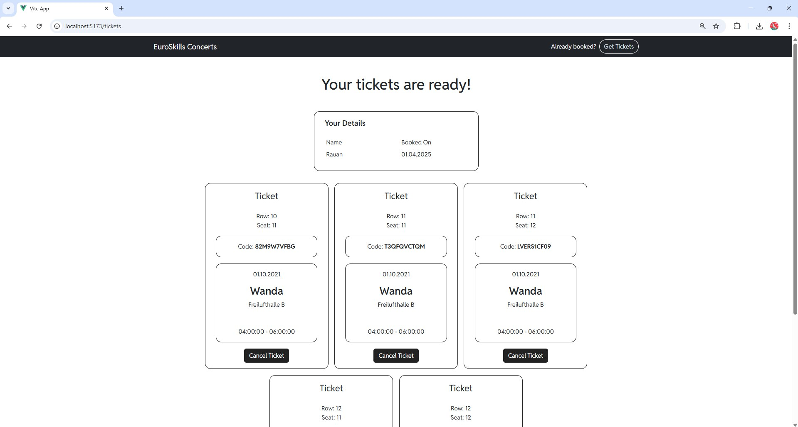

# EuroSkills-Concerts

Добро пожаловать в **EuroSkills-Concerts** — современную веб-платформу для бронирования билетов на концерты и музыкальные события в рамках EuroSkills. Этот проект создан для того, чтобы сделать покупку билетов быстрой, удобной и приятной. Выбирайте лучшие места в зале, бронируйте билеты и получайте их в цифровом виде по уникальному коду — всё это в несколько кликов!

Проект построен на **Vue.js 3** с использованием **Vite**, что обеспечивает высокую скорость разработки и производительность приложения. Платформа идеально подходит как для организаторов мероприятий, так и для зрителей, ценящих комфорт и современные технологии.

---

## О проекте

**EuroSkills-Concerts** — это:
- **Интерактивный выбор мест**: Просматривайте схему зала и выбирайте идеальные места для вашего концертного опыта.
- **Простое бронирование**: Быстрый и надежный процесс покупки билетов с мгновенным подтверждением.
- **Цифровые билеты по коду**: Получайте билеты в электронном формате с использованием уникального кода (например, `T3QFQVCTQM`), который генерируется системой.
- **Адаптивный дизайн**: Платформа работает на любых устройствах — от смартфонов до настольных компьютеров.

---

## Установка проекта

### 1. Установка зависимостей
```sh
npm install
```

### 2. Запуск в режиме разработки с горячей перезагрузкой
```sh
npm run dev
```
Откройте `http://localhost:5173` в браузере, чтобы увидеть приложение в действии.

### 3. Сборка для продакшена
```sh
npm run build
```
Получите оптимизированную и минифицированную версию приложения для развертывания.

---

## Возможности и преимущества

- **Быстродействие**: Благодаря Vite и Vue 3 платформа загружается молниеносно.
- **Гибкость**: Легко настраиваемая структура для добавления новых функций.
- **Пользовательский опыт**: Интуитивный интерфейс, ориентированный на удобство зрителей.
- **Масштабируемость**: Подходит как для небольших концертов, так и для крупных мероприятий EuroSkills.

---

## Как это работает?

1. **Выбор мероприятия**: Пользователь выбирает концерт из списка доступных событий.
2. **Интерактивная схема зала**: Отображается карта мест с возможностью выбора.
3. **Бронирование**: После выбора мест билеты добавляются в корзину и подтверждаются.
4. **Получение билетов**: Система генерирует уникальный код (например, `T3QFQVCTQM`), с помощью которого пользователь может получить свои электронные билеты.

---

## Скриншоты

Ознакомьтесь с интерфейсом платформы через скриншоты ниже:

- **Главный экран**: Начальная страница с выбором мероприятий.  
  

- **Выбор мест**: Интерактивная схема зала для выбора мест.  
  

- **Выбранные места**: Подтверждение выбранных мест перед бронированием.  
  

- **Заполнение данных для билетов**: Ввод информации для завершения покупки.  
  

- **Мои билеты**: Просмотр приобретенных билетов с уникальным кодом .  
  

- **Получение билетов**: Страница для ввода кода и получения билетов.  
  

---

## Структура проекта

```
/concert-vuejs
├── .idea/                  # Конфигурация IntelliJ IDEA 
├── .vscode/                # Настройки VSCode
├── node_modules/           # Зависимости Node.js
├── public/                 # Статические файлы
│   ├── favicon.ico         # Иконка сайта
│   └── screenshots/        # Скриншоты приложения
│       ├── filling_in_data_for_tickets.jpg
│       ├── main_screen.jpg
│       ├── my_tickets.jpg
│       ├── Retrieve_tickets.jpg
│       ├── select_seats.jpg
│       └── selected_seats.jpg
├── src/                    # Исходный код приложения
│   ├── api/                # API-функции
│   │   └── index.js        # Основной файл API
│   ├── assets/             # Статические ресурсы (изображения, стили и т.д.)
│   ├── components/         # Переиспользуемые компоненты Vue
│   │   └── CardComponent.vue  # Компонент карточки
│   ├── router/             # Настройка маршрутизации
│   │   └── index.js        # Определение маршрутов
│   ├── stores/             # Хранилища состояния (Pinia)
│   │   ├── useConcertsStore.js  # Хранилище для концертов
│   │   ├── useSeatingStore.js   # Хранилище для выбора мест
│   │   └── useTicketsStore.js   # Хранилище для билетов
│   ├── views/              # Представления (страницы приложения)
│   │   ├── AboutView.vue   # Страница "О проекте"
│   │   ├── BookingView.vue # Страница бронирования
│   │   ├── GetTicketsView.vue # Страница получения билетов
│   │   ├── HomeView.vue    # Главная страница
│   │   ├── SeatingView.vue # Страница выбора мест
│   │   └── TicketsView.vue # Страница управления билетами
│   ├── App.vue             # Корневой компонент приложения
│   └── main.js             # Точка входа в приложение
├── .gitignore              # Файлы и папки, игнорируемые Git
├── index.html              # Главный HTML-файл
├── jsconfig.json           # Конфигурация JavaScript для IDE
├── package-lock.json       # Фиксация версий зависимостей
├── package.json            # Описание проекта и зависимостей
├── README.md               # Документация проекта
└── vite.config.js          # Конфигурация Vite
```

---
